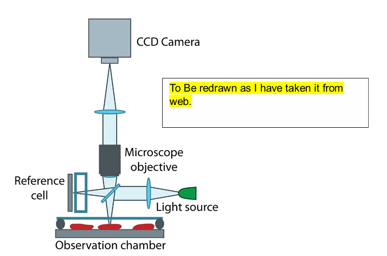
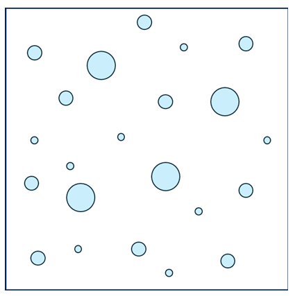
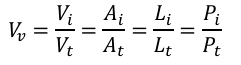
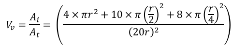
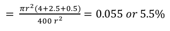
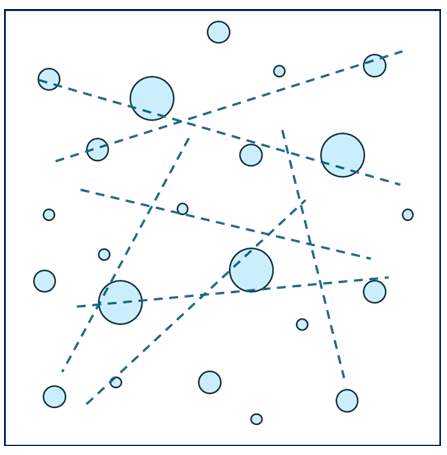
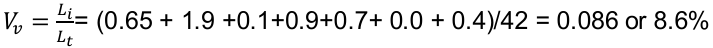
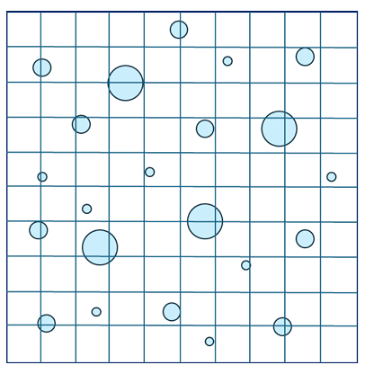
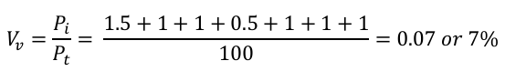

Quantitative microscopy or quantitative phase-contrast microscopy allows quantification of the 
present phases via isolating each phase distinguishable (due to contrast) from each other. 
The density differences (in transparent/translucent) or phase-shifted reflective/scattering light 
events that provide a clear indication of difference in the microstructural-phase of material 
under observation in a microscope.   

 

Quantitative observations are becoming highly relevant as it allows correlations among the 
microstructural features with certain processing or property observations. Thus, instead of a 
qualitative observation, certain affirmations can be provided for the same. In addition, 3-D 
structures may be deduced from this extension (stereology). Quantitative microscopy permits 
assessing grain-size measurement or estimating volume fraction analysis on a multi-phase 
sample. These measurements, though statistical in nature, can be very closer to actual values 
as multiple measurements are made that average out the variations.  

With availability of high-end automation and measurement tools, these studies can be 
automated. With the advent of machine learning (ML) and artificial intelligence (AI), these can 
become as potential tools to provide inputs to taking up pre-emptive and corrective measures 
in the manufacturing industries for any predictions/assessments.  

 
Microstructure with second phase particles (shown with light blue colour).  

The total volume fraction of second phase (Vv) can be given as : 

 

Where Vi is the volume of the second phase, and Vt is the total volume of the material (in 3D). Accordingly, these can also be equated to corresponding ratio of Area of the second phase (Ai) to that of total area (At) in 2-D called as ,
<b>‘areal analysis’</b>. Extending the same, the relation to ratio of line-intercept length (Li) to that of total length (Lt) of line (in 1-D) called as ,<b>‘lineal analysis’</b> or even ratio of points falling on second phase (Pi) to that of total points (Pt) called as ,<b>‘point counting’</b>. Depending upon the homogeneity of material, appropriate (and representative) section must be taken for analysis, and statistical coverage must be included for obtaining confidence on these estimates. 

Let us check the volume fraction utilizing the areal fraction, which can be measured by 
taking area of each circle (i.e. there are 4 circles with radius of r, 10 circles with radius of 
(r/2) and 8 circles of radius (r/4) with the total area (square with each side of 20r), which 
comes out as:  

 
 

Now let us extend the calculation by using lineal analysis, or taking multiple measurements 
(i.e. seven dashed lines shown here) measuring the length of intersection to the total length 
of line.  
 
 

Note that lineal analysis value is different (in this case much higher) than that of areal 
analysis. As the number of observation length will increase, this value will tend to be closer 
to the areal analysis. Extending this concept further, the point analysis can be assessed from 
image below.  
 

As the volume fraction can also be assessed as 𝑉𝑣 = 𝑃𝑖/𝑃𝑡, the counting results the value (each 
node taken as 1 if falling within the circle, and half if the circle is tangent to the nodal point.  

 

It may be noted that the value through point counting method is, again different than that 
obtained from areal and lineal analysis. Such a difference arises because these are 
‘estimates’ and many observations must be recorded to provide statistical relevance and 
average out variations in the readings.

